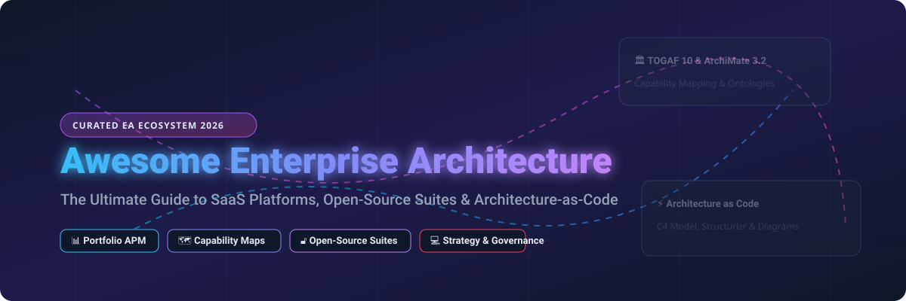
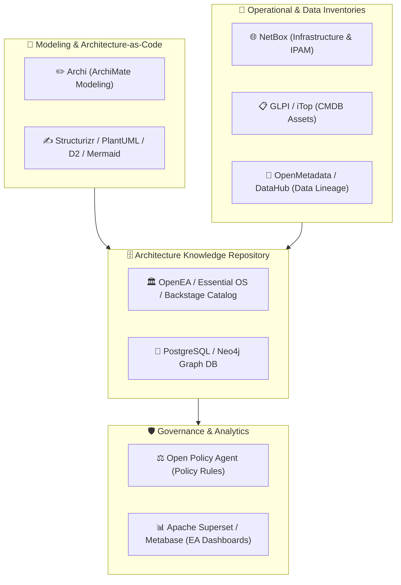

  

  
  
  
  
  
  
  

<h1 align="center">🏛️ Awesome Enterprise Architecture Ecosystem 🌐</h1>

  <strong>The Ultimate Curated List of SaaS Platforms, Open-Source Repositories &amp; Architecture-as-Code Tooling for Modern Enterprise Architecture Management (EAM), TOGAF 10, ArchiMate 3.2, Capability Mapping, and Application Portfolio Management (APM).</strong>

---

## 📑 Table of Contents
- [✨ Overview](#-overview)
- [🏢 SaaS & Hosted Commercial Platforms](#-saas--hosted-commercial-platforms)
- [🔓 Open-Source GitHub Projects & Repositories](#-open-source-github-projects--repositories)
- [🏗️ Self-Hosted Enterprise Architecture Blueprint](#-self-hosted-enterprise-architecture-blueprint)
- [🤝 How to Contribute](#-how-to-contribute)
- [⚠️ Disclaimer](#%EF%B8%8F-disclaimer)
- [📈 Star History](#-star-history)
- [💖 Support & Sponsorship](#-support--sponsorship)

---

## ✨ Overview

Welcome to the **Awesome Enterprise Architecture** repository! This curated catalog tracks leading enterprise architecture platforms, tools, and open-source frameworks. It serves Enterprise Architects, Solution Architects, IT Strategists, CTOs, and CIO teams modeling, governing, analyzing, and modernizing complex enterprise ecosystems.

Key domain coverage includes:
- 🗺️ **Business Architecture & Capability Mapping**
- 💻 **Application Portfolio Management (APM)**
- ⚙️ **Technology Landscape Management & Roadmapping**
- 🛡️ **Architecture Governance & Risk Management**
- ✍️ **Architecture-as-Code (C4 Model, ArchiMate, Structurizr, UML)**
- 📊 **IT Portfolio Analytics & Decision Support**

---

## 🏢 SaaS & Hosted Commercial Platforms

> 💡 **Market Size & Structure Summary:**
> The global Enterprise Architecture (EA) software market is estimated at **$4.2 Billion** (2025/2026) and is projected to expand to **$7.8 Billion by 2030** (CAGR of ~10.5%). The sector is **moderately fragmented** but undergoing active platform consolidation, as enterprise workflow leaders (e.g., ServiceNow, SAP) acquire niche EA specialists while dedicated platforms compete on data-driven modeling and automated discovery.

The table below lists top commercial SaaS enterprise architecture suites, sorted by **Company Size / Revenue / Valuation (Descending)**:

| 🏢 Platform | 💰 Starting Tier Price | 🎁 Free Tier / Trial Limits | 📈 Company Size / Valuation | 🎯 Core Focus & Key Capabilities |
| :--- | :--- | :--- | :--- | :--- |
| **[ServiceNow EA](https://www.servicenow.com/)** | ~$100 / user / month *(Enterprise baseline quote)* | Personal Developer Instance (PDI) with full capabilities *(Hibernates after 10 days inactivity)* | **~$140.0B Market Cap** *(~$13.28B Revenue)* | Integrated EA workspace, application rationalization, ITOM/ITSM alignment, strategy mapping. |
| **[IBM System Architect](https://www.ibm.com/)** | ~$5,200 / license / year *(~$433 / user / mo)* | 30-Day evaluation trial *(Feature locked demo sandbox)* | **~$200.0B Market Cap** *(~$62.00B Revenue)* | Enterprise engineering, formal architecture modeling, complex systems & compliance governance. |
| **[SAP LeanIX](https://www.leanix.net/)** | ~$1,250 / month *($15,000 / year starter suite)* | 14-Day full feature free sandbox trial *(No free forever plan)* | **~$240.0B SAP Cap** *(~$1.2B Acquisition / ~$34B Rev)* | Cloud-native APM, SaaS management, business capability mapping, transformation roadmaps. |
| **[Software AG Alfabet](https://www.softwareag.com/)** | ~$1,500 / month *($18,000 / year FastStart)* | 30-Day hosted trial environment *(No free forever plan)* | **~$2.6B Acquisition** *(~$1.00B Revenue)* | Strategic IT portfolio management, technology risk analysis, investment planning & governance. |
| **[Archer GRC & EA](https://www.archerirm.com/)** | ~$1,250 / month *($15,000 / year base platform)* | 30-Day requested demo sandbox trial *(No free forever plan)* | **~$2.0B Acquisition** *(~$250M Revenue)* | Integrated GRC, technology risk governance, security architecture & risk management. |
| **[Planview EA](https://www.planview.com/)** | ~$29 / user / month *(Base portfolio tier; $70/mo EA)* | 30-Day free trial *(Up to 5 users, standard portfolio features)* | **~$1.6B Acquisition** *(~$400M Revenue)* | Strategic portfolio management, capability-based planning, transformation execution alignment. |
| **[Ardoq](https://www.ardoq.com/)** | ~$900 / month *($10,800 / year essential workspace)* | 14-Day free trial *(Sample enterprise dataset included)* | **~$180M Valuation** *(~$30M Revenue)* | Data-driven dynamic architecture, graph visualizations, auto-generated application landscapes. |
| **[BiZZdesign Horizzon](https://bizzdesign.com/)** | ~$1,000 / month *($12,000 / year team tier)* | 14-Day interactive cloud trial *(No free forever plan)* | **~$150M Valuation** *(~$60M Revenue)* | ArchiMate & TOGAF compliance, capability modeling, Enterprise Studio integration. |
| **[Orbus iServer365](https://www.orbussoftware.com/)** | ~$750 / month *($9,000 / year starter suite)* | 30-Day guided interactive trial *(No free forever plan)* | **~$120M Valuation** *(~$35M Revenue)* | Microsoft 365 integrated EA repository, SharePoint/Visio sync, business architecture. |
| **[MEGA HOPEX](https://www.mega.com/)** | ~$800 / month *($9,600 / year repository block)* | 30-Day hosted sandbox trial *(No free forever plan)* | **~$100M Valuation** *(~$50M Revenue)* | Governed architecture repository, data governance, business process & application architecture. |
| **[Avolution ABACUS](https://www.avolutionsoftware.com/)** | ~$600 / month *($7,200 / year cloud starter)* | 30-Day free trial account *(No free forever plan)* | **~$60M Valuation** *(~$20M Revenue)* | Graph analytics, roadmapping, multi-framework support (TOGAF, ArchiMate, FEAF, DODAF). |
| **[Sparx Enterprise Architect](https://sparxsystems.com/)** | $249 / user *(One-time Desktop license; $349 Corporate)* | 30-Day fully functional trial *(Reverts to read-only viewer mode)* | **~$50M Valuation** *(~$25M Revenue)* | Desktop UML/ArchiMate modeling suite, SysML, BPMN, robust repository features. |
| **[ValueBlue (BlueDolphin)](https://valueblue.com/)** | ~$500 / month *($6,000 / year starter env)* | 14-Day free trial on BlueDolphin platform *(No free forever plan)* | **~$40M Valuation** *(~$12M Revenue)* | Collaborative agile EA, business capability maps, application & technology visualization. |

---

## 🔓 Open-Source GitHub Projects & Repositories

The open-source ecosystem provides complete self-hosted alternatives, architecture-as-code engines, metadata hubs, CMDB asset trackers, and diagramming tools.

Below is the curated list of Open-Source Repositories, sorted by **GitHub Star Count (Descending)**. Each star badge links directly to that repository's stargazers page:

1. 🔀 **[Mermaid](https://github.com/mermaid-js/mermaid)** 
   - *Description:* JavaScript-based diagramming and visualization tool rendering text definitions into flowcharts, architecture views, sequence diagrams, and timelines.

2. 📊 **[Apache Superset](https://github.com/apache/superset)** 
   - *Description:* Modern enterprise data exploration and visualization platform ideal for constructing executive EA dashboards over application repositories.

3. 📈 **[Metabase](https://github.com/metabase/metabase)** 
   - *Description:* Open-source business intelligence and portfolio telemetry dashboard framework for querying architecture repository SQL databases.

4. 🎨 **[Diagrams (Python)](https://github.com/mingrammer/diagrams)** 
   - *Description:* Declarative Architecture-as-Code framework in Python for prototyping cloud system architectures without manual graphical design tools.

5. 🗄️ **[DrawDB](https://github.com/drawdb-io/drawdb)** 
   - *Description:* Free, browser-based database design and entity-relationship architecture modeling environment.

6. 🏛️ **[Backstage](https://github.com/backstage/backstage)** 
   - *Description:* CNCF developer portal framework providing software cataloging, service ownership mapping, and technical metadata management.

7. 📝 **[D2 Language](https://github.com/d2lang/d2)** 
   - *Description:* Modern declarative diagramming language that turns text into scriptable, clean system architecture diagrams.

8. 🔄 **[Renovate](https://github.com/renovatebot/renovate)** 
   - *Description:* Automated dependency lifecycle management platform for tracking and governing software stack lifecycles across enterprise portfolios.

9. 🌐 **[NetBox](https://github.com/netbox-community/netbox)** 
   - *Description:* Authoritative infrastructure resource-modeling platform for managing network infrastructure, IP address management (IPAM), and rack topologies.

10. 📑 **[OpenMetadata](https://github.com/open-metadata/OpenMetadata)** 
    - *Description:* Unified metadata management, data lineage, data asset cataloging, and enterprise data architecture governance platform.

11. 🛡️ **[Bytebase](https://github.com/bytebase/bytebase)** 
    - *Description:* Database DevOps, schema governance, and data security architecture management platform for enterprises.

12. 📐 **[PlantUML](https://github.com/plantuml/plantuml)** 
    - *Description:* Industry-standard architecture-as-code diagramming tool generating UML, ArchiMate, BPMN, and system structure diagrams from plain text.

13. 🔗 **[DataHub](https://github.com/datahub-project/datahub)** 
    - *Description:* Extensible metadata platform for end-to-end data asset governance, relationship graphs, and enterprise technical metadata cataloging.

14. ⚖️ **[Open Policy Agent (OPA)](https://github.com/open-policy-agent/opa)** 
    - *Description:* General-purpose policy engine enabling automated architecture compliance rules, technology standards enforcement, and governance checks.

15. 📡 **[OpenTelemetry Collector](https://github.com/open-telemetry/opentelemetry-collector)** 
    - *Description:* Telemetry data collector supplying real-time operational runtime dependency evidence to enterprise architecture repositories.

16. 🧱 **[C4-PlantUML](https://github.com/plantuml-stdlib/C4-PlantUML)** 
    - *Description:* PlantUML macro library implementing the C4 model for software architecture context, container, component, and code diagrams.

17. 💻 **[GLPI](https://github.com/glpi-project/glpi)** 
    - *Description:* Open-source IT asset management, CMDB infrastructure tracking, and service management system.

18. 🧩 **[LikeC4](https://github.com/likec4/likec4)** 
    - *Description:* Architecture-as-code tool for modeling and rendering interactive, type-safe software architecture diagrams based on C4 concepts.

19. 🛠️ **[OpenRewrite](https://github.com/openrewrite/rewrite)** 
    - *Description:* Automated source-code refactoring and transformation engine for executing large-scale technology stack modernization.

20. 🗺️ **[Apache Atlas](https://github.com/apache/atlas)** 
    - *Description:* Scalable enterprise data governance and metadata framework for mapping enterprise data assets, relationships, and lineage.

21. ✏️ **[Archi](https://github.com/archimatetool/archi)** 
    - *Description:* The leading cross-platform open-source ArchiMate modeling tool for creating, visualizing, and exchanging TOGAF/ArchiMate EA models.

22. 📋 **[iTop CMDB](https://github.com/Combodo/iTop)** 
    - *Description:* Web-based IT service management (ITSM) and CMDB suite providing IT asset relationship modeling for EA repos.

23. ☕ **[Structurizr Java](https://github.com/structurizr/java)** 
    - *Description:* Java library and DSL tooling for creating software architecture models based on the C4 model.

24. 🗂️ **[Essential Open Source](https://github.com/essential-architecture-manager/essential-architecture-manager)** 
    - *Description:* Full-featured open-source enterprise architecture management suite built on a governed enterprise ontology repository covering business, application, technology, and strategic domains.

25. 🚀 **[Eclipse Capella](https://github.com/eclipse-capella/capella)** 
    - *Description:* Model-Based Systems Engineering (MBSE) workbench implementing the Arcadia methodology for complex system decomposition and logical/physical architecture.

26. 📐 **[Modelio](https://github.com/Modelio/Modelio)** 
    - *Description:* Open modeling environment supporting UML, BPMN, requirements engineering, and custom EA extensions.

27. 🏛️ **[OpenEA](https://github.com/OpenEA/OpenEA)** 
    - *Description:* Repository-first, open-source EA platform designed as a self-hosted alternative to LeanIX for managing architecture knowledge as structured data.

---

## 🏗️ Self-Hosted Enterprise Architecture Blueprint

Want to assemble a zero-license-cost, production-grade Enterprise Architecture platform? You can combine open-source building blocks into a unified stack:

---

## 🤝 How to Contribute

Contributions are warmly welcomed! Help expand this enterprise architecture ecosystem by following these guidelines:

1. 🍴 **Fork** this repository.
2. ➕ **Add** your recommended SaaS product or Open-Source project to the appropriate section.
3. 🔗 Ensure SaaS products include official homepages and valid pricing/trial details.
4. ⭐ Ensure Open-Source repos include GitHub star count badges linking to `/stargazers`.
5. 📝 Keep descriptions concise, objective, and technically precise.
6. 🚀 Submit a **Pull Request (PR)** with a clear title and description.

---

## ⚠️ Disclaimer

- This catalog is a curated informational ecosystem and does not imply ranking or commercial endorsement.
- SaaS pricing, features, free trial durations, and company valuations change over time. Verify current terms directly with vendor sites.
- Open-source repository star counts are updated periodically. Always review open-source licenses and security posture before enterprise adoption.

---

## 📈 Star History

---

## 💖 Support & Sponsorship

If you find this enterprise architecture ecosystem resource valuable, please consider supporting the project:

- ⭐ **Star** this repository on GitHub to boost visibility.
- 🔀 **Fork** and share it with your enterprise architecture colleagues and technology leaders.
- ☕ **Sponsor** the maintainer or buy a coffee via [GitHub Sponsors](https://github.com/sponsors/ishandutta2007).

  

  <em>Thank you for contributing to an open, connected, and data-driven Enterprise Architecture community! 🚀</em>

